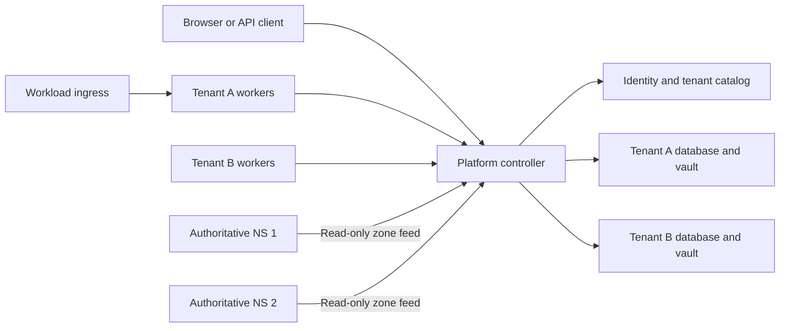

# Hosted tenants

Hosted Dispatch runs as a separate `dispatch-platform` process. The existing
`dispatch` binary keeps its single-installation behavior. Use a new data directory
and catalog for hosted mode. This change does not convert or deploy the existing
server.

The platform account can create tenants and read tenant names, states, creation
dates, and usage totals. It cannot read applications, repositories, logs, secrets,
member lists, or deployment configuration. It cannot change a tenant after
creation. An explicitly granted tenant membership gives that same account the
permissions of its tenant role. Creating a tenant does not grant membership.

An owner manages tenant membership. An admin manages the tenant's operational
resources and can view membership. A member uses the existing project and team
grants. Only an owner can add, remove, or change members, and a tenant must retain
an active owner.

## Processes and data



The central catalog stores identities, memberships, sessions, DNS ownership,
provisioning state, and usage aggregates. Each tenant has its own database login,
database, encryption key, Git cache, artifacts, and analytics. See
[tenant data isolation](tenant-data-isolation.md).

The controller handles API requests and scheduling. Workers execute commands,
build images, and deploy to tenant targets. They connect outbound over HTTPS;
enrollment and work leases are tenant-scoped. See [workflow workers](workflow-workers.md).
Dedicated tenant workers may use their own Docker daemon. Managed workers run
simple jobs without network access, repository checkout, or a Docker socket.
Managed nodes still have an explicit tenant enrollment. Sharing a machine across
managed workers does not grant a worker access to another tenant's queue.

Only one hosted controller may use a catalog at a time. A PostgreSQL advisory
lock and a data-directory lock enforce this. Restart the controller to replace
it. This version does not provide active-active controller failover.

## Hostnames, sessions, and DNS

`dispatch.cicd.onl` serves global login, account settings, tenant selection, and the
platform directory. `agentops.dispatch.cicd.onl` serves that tenant's console.
Unknown hosts and deeper workload names never fall through to a tenant console.
Forwarded Host headers do not select a tenant.

Login creates a host-only secure cookie. Entering a tenant uses a one-use,
one-minute handoff bound to the tenant, HTTPS origin, and PKCE verifier. The
resulting cookie belongs to the exact tenant console host. Membership and account
state are checked on requests and live-stream refreshes. A platform cookie does
not authorize a tenant API. Existing tenant automation tokens continue to work
against that tenant's operational API.

Delegate `dispatch.cicd.onl` to the configured nameservers. The controller creates
console records and, when a workload ingress is configured, a wildcard beneath
each tenant. For example:

| Name | Destination |
| --- | --- |
| `dispatch.cicd.onl` | Control-plane ingress |
| `agentops.dispatch.cicd.onl` | Control-plane ingress |
| `*.agentops.dispatch.cicd.onl` | Workload ingress |

A wildcard DNS answer supplies the ingress address. The ingress still needs the
application's matching host rule and TLS certificate. Existing target routing
owns workload traffic. The control-plane HTTP listener never proxies workload
requests. Tenant administrators can add explicit A, AAAA, CNAME, or TXT records
for one-label workload names through `/api/v1/hosted/dns`; they cannot replace
console, wildcard, ACME, or another tenant's records.

Read [authoritative DNS](authoritative-dns.md) before delegation. It covers two
nameservers, UDP and TCP port 53, parent glue, snapshot replication, and DNS-01.

An in-zone nameserver reserves the tenant subdomain that contains it. For example,
`ns1.infrastructure.dispatch.cicd.onl` reserves `infrastructure`; a tenant cannot
take that name. Nameserver configuration also cannot move into an existing
tenant's subdomain.
The zone is unsigned. Do not publish a parent DS record for this version.

## Preparing a new installation

These commands are for the new installation host. They are not an upgrade or a
migration procedure for an existing Dispatch data directory.

Build `Containerfile.hosted`, `Containerfile.worker`, and `Containerfile.dns`, or
run `scripts/build-release.sh <version>` to produce the platform binary archive.
The hosted controller image contains no Docker CLI or socket mount.

Create a private data directory and credential files readable only by the service
account. Use a dedicated PostgreSQL catalog database. The tenant database
provisioner needs permission to create databases and restricted login roles;
these credentials stay outside tenant runtime connections.

```sh
export DISPATCH_HOSTED_DATA_DIR=/var/lib/dispatch-platform
export DISPATCH_HOSTED_ROOT_DOMAIN=dispatch.cicd.onl
export DISPATCH_HOSTED_CATALOG_URL_FILE=/run/secrets/dispatch-catalog-url
export DISPATCH_HOSTED_POSTGRES_ADMIN_URL_FILE=/run/secrets/dispatch-provisioner-url
export DISPATCH_HOSTED_CONSOLE_ADDRESSES=192.0.2.10
export DISPATCH_HOSTED_WORKLOAD_GATEWAY=192.0.2.20
export DISPATCH_HOSTED_NAMESERVERS=ns1.dispatch.cicd.onl,ns2.dispatch.cicd.onl
export DISPATCH_HOSTED_NAMESERVER_ADDRESSES=ns1.dispatch.cicd.onl=192.0.2.53,ns2.dispatch.cicd.onl=198.51.100.53
export DISPATCH_HOSTED_DNS_TOKEN_FILE=/run/secrets/dispatch-dns-token
export DISPATCH_HOSTED_ADDR=0.0.0.0:8443
export DISPATCH_HOSTED_TLS_MODE=certificate
export DISPATCH_HOSTED_TLS_CERT_FILE=/run/secrets/dispatch-console-chain.pem
export DISPATCH_HOSTED_TLS_KEY_FILE=/run/secrets/dispatch-console-key.pem
```

The addresses above are documentation addresses. Replace them before use.
Credential files use mode `0600`, and the data directory uses `0700`. The catalog
URL and provisioner URL are PostgreSQL connection strings with TLS settings for
your database. The DNS token contains at least 32 random characters. Nameservers
inside the delegated zone require matching parent glue addresses.

Before starting the controller, bootstrap the first platform account:

```sh
dispatch-platform bootstrap-user \
  --email admin@example.com --name 'Platform administrator' \
  --password-file /run/secrets/dispatch-initial-password
```

The password must contain 12 to 72 bytes. Bootstrap only works on an empty identity
catalog. It cannot elevate an existing user or create another administrator after
accounts exist. Start the service with `dispatch-platform serve` after bootstrap.

### Accounts without email delivery

For a private installation without email delivery, an operator can create a
verified account from the controller host. Verify the person's identity first
and share the initial password through a private channel. Stop the hosted
controller, then run this with the same data directory and catalog configuration:

```sh
dispatch-platform create-user \
  --email owner@example.com --name 'Tenant owner' \
  --password-file /run/secrets/dispatch-owner-password
```

The password file must be a private regular file with mode `0600`. The initial
platform administrator must already exist. This command refuses existing email
addresses and grants no platform role or tenant membership. Restart the
controller, then create a tenant in the tenant directory using this account's
email as its owner. The account can sign in immediately without a verification
email. Its owner can change the password under Account.

### Recovering the platform administrator

If an administrator loses their password, stop the hosted controller and use the
same data directory and catalog configuration:

```sh
dispatch-platform recover-admin \
  --email admin@example.com \
  --password-file /run/secrets/dispatch-new-password
```

This command requires a private password file and an existing active, verified
platform administrator. It cannot create or promote an account, re-enable a
disabled account, or change tenant membership. All existing account sessions and
sign-in handoffs become invalid. Remove the password file and restart the
controller after the command succeeds. Both commands refuse to run while another
controller holds the data directory or catalog lock.

### Email registration

Configure SMTP to let invited tenant owners and other users register:

```sh
export DISPATCH_HOSTED_SMTP_ADDRESS=smtp.example.com:587
export DISPATCH_HOSTED_SMTP_FROM=dispatch@example.com
export DISPATCH_HOSTED_SMTP_USERNAME=dispatch
export DISPATCH_HOSTED_SMTP_PASSWORD_FILE=/run/secrets/dispatch-smtp-password
```

SMTP requires STARTTLS with certificate verification. Registration sends a
verification link; its recipient chooses the first password. If SMTP is not
configured, registration is unavailable. The initial tenant owner must be an
existing verified user or the exact email recipient of an invitation. Invitations
appear after that person verifies and signs into their account. A platform admin
cannot claim them on the recipient's behalf.

SQLite is available for disposable development with
`DISPATCH_HOSTED_ALLOW_SQLITE=true`. It creates a catalog file and separate tenant
files under the new data directory. Production hosted mode expects PostgreSQL.

## TLS bootstrap and renewal

Use `DISPATCH_HOSTED_TLS_MODE=certificate` with an existing certificate while
starting DNS replicas. The replicas need working HTTPS to fetch their zone.
Delegation alone cannot bootstrap that HTTPS connection. Supply a trusted
bootstrap certificate and establish both nameservers before switching to ACME
issuance. Do not disable certificate verification to get through bootstrap.

Keep certificate or proxy TLS mode while testing DNS-01 issuance. Renewal runs
whenever an ACME directory is configured, independently of the serving mode:

```sh
export DISPATCH_HOSTED_TLS_MODE=certificate
export DISPATCH_HOSTED_ACME_DIRECTORY=https://acme-staging-v02.api.letsencrypt.org/directory
export DISPATCH_HOSTED_ACME_EMAIL=operations@example.com
export DISPATCH_HOSTED_ACME_ACCEPT_TERMS=true
```

Use staging until DNS-01 and certificate installation work. Keep the trusted
bootstrap certificate configured so DNS replicas can still fetch their zone.
Staging issuance must not serve console HTTPS; ACME serving mode rejects the
Let's Encrypt staging directory. Switch to the production directory while
keeping certificate or proxy mode. Once production issuance works, select
`DISPATCH_HOSTED_TLS_MODE=acme` if the controller terminates HTTPS. ACME mode can
retain the configured bootstrap certificate for the root host until its first
managed certificate is ready. Renewal runs every five minutes, independently of
builds and deployments. Existing certificates remain available during renewal
failures until they expire.

The controller obtains one certificate for the root and tenant consoles, and a
separate wildcard certificate for each tenant's workload namespace. DNS replicas
receive TXT records, never certificate private keys. An authenticated tenant
owner or admin can retrieve only that tenant's workload bundle at
`GET /api/v1/hosted/certificate`. The response includes `certificatePem`,
`privateKeyPem`, `notAfter`, and `renewAfter`. Configure the workload ingress to
install and refresh its tenant bundle with `dispatch-certificate-sync`. A tenant
owner or admin issues a separate 90-day download credential; the ingress does not
need a browser session or the platform key. See [certificate installation](certificate-installation.md)
for credential rotation, atomic file installation, nginx reload and the timer.

Alternatively, terminate HTTPS in a proxy on the same machine with
`DISPATCH_HOSTED_TLS_MODE=proxy` and a loopback listener. Set
`DISPATCH_HOSTED_TRUSTED_PROXIES=127.0.0.1/32,::1/128` only for proxies that replace
or correctly append `X-Forwarded-For`. Host and Origin checks still use the public
configured domain. Proxy mode is rejected on public listener addresses.

## Tenant creation and usage

The platform directory accepts a tenant name, slug, and initial owner email.
Creation returns `202` and a pending tenant. The controller retries provisioning
from durable state after failures or restarts. It creates the isolated database,
vault and directories, publishes DNS, then marks the tenant active. A failed
attempt records a fixed provisioning phase, not raw database errors or tenant
content. Tenant slugs and the root domain are immutable in this version.

Usage collection refreshes daily buckets once a minute. It exports current
project, application, and active membership counts, completed nonreused job
counts and execution seconds, and deployment counts. Job counts include failed
and cancelled jobs. Current-day values are partial; `updatedAt` records collection
time. `measured` explicitly lists available metrics. Storage, network transfer,
and workload runtime duration are not measured and must not be interpreted as
zero. Usage is operational telemetry, not an invoice calculation.

The platform API has no post-creation tenant mutation, impersonation, membership
override, operational resource, or credential endpoint. Membership changes use a
separate API that checks the acting account's tenant owner role. See
[hosted API](hosted-openapi.yaml) for routes and request contracts.

## Handoff checks

Before accepting users on a new installation:

1. Verify both authoritative servers over UDP and TCP from outside their networks,
   including negative answers and a tenant wildcard.
2. Create two test tenants with different owners. Confirm platform-only access
   cannot enter either tenant, and tenant sessions and worker credentials cannot
   cross between them.
3. Register a dedicated tenant worker, run a build with live logs, cancel a run,
   and deploy to its intended target. Verify a managed worker cannot receive a
   tenant-mode build or repository credentials.
4. Complete staging DNS-01 issuance and test renewal without running a deployment.
   Install the tenant certificate at the workload ingress and verify host routing.
5. Back up the catalog, tenant databases, generated database credentials, vault
   keys, ACME state, and worker receipts. Test recovery into separate infrastructure.

Existing single-installation data is not imported automatically. An offline,
reviewed import and production provider/ingress configuration belong to the next
deployment task. No current server configuration, delegation, data, or images are
changed by building this branch.

## Hosted execution limits

Hosted mode rejects operations that still require local controller tools or files.
These include controller backup/restore, SSH installation, Laneway installation,
mounted kubeconfig paths, local repository paths, and interactive OpenShift login.
Direct Helm chart inspection, values and release previews, live deployment
topology and diagnosis, drift checks and reapply, and Helm rollback are also
unavailable. Deploy the desired chart revision to change a Helm release.

Tenant workload backups on enrolled Docker targets remain separate from
controller backup. Docker applications without shell hooks retain the existing
remote runtime's routing and rollback support. Hooked deployments run in the
isolated worker; combinations that require persistent managed-route state are
rejected until they have a remote implementation.

New Kubernetes target validation runs on the project's worker, including cluster
and namespace identity checks. Helm deployments, service provisioning, service
inspection and deletion, and Kubernetes storage inspection and deletion use the
worker queue. Deletion still requires the existing ownership and storage checks.
Private infrastructure provider calls require an enrolled relay.
Hosted HTTP integrations reject private, loopback, link-local and mixed public/
private DNS destinations at connection time. A DNS answer is validated and the
connection uses that exact IP, avoiding a second lookup that could change it.

Apply network egress policy to the control-plane host or container as well.
Git's SSH and HTTPS clients are external programs and do not use Go's HTTP
transport. Permit the configured database, SMTP service, authoritative DNS
servers, and required public Git/API endpoints. Deny tenant-controlled access to
cloud metadata and unrelated internal services. Private Git/secret/provider
access should use the tenant's enrolled connection. Do not place credentials or
mounts for workload execution on the control-plane process.
