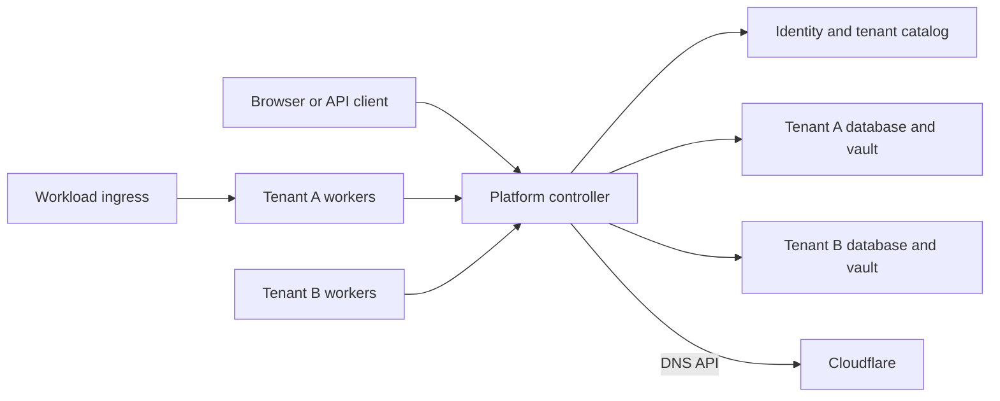

# Hosted tenants

Hosted Dispatch runs as a separate `dispatch-platform` process. The existing
`dispatch` binary keeps its single-installation behavior. Use a new data directory
and catalog for hosted mode. This change does not convert or deploy the existing
server.

The platform account can create tenants and read tenant names, states, creation
dates, and usage totals. It cannot read applications, repositories, logs, secrets,
member lists, or deployment configuration. It cannot change a tenant after
creation. An explicitly granted tenant membership gives that same account the
permissions of its tenant role. Creating a tenant does not grant membership.

An owner manages tenant membership. An admin manages the tenant's operational
resources and can view membership. A member uses the existing project and team
grants. Only an owner can add, remove, or change members, and a tenant must retain
an active owner.

## Processes and data



The central catalog stores identities, memberships, sessions, DNS ownership,
provisioning state, and usage aggregates. Each tenant has its own database login,
database, encryption key, Git cache, artifacts, and analytics. See
[tenant data isolation](tenant-data-isolation.md).

The controller handles API requests and scheduling. Workers execute commands,
build images, and deploy to tenant targets. They connect outbound over HTTPS;
enrollment and work leases are tenant-scoped. See [workflow workers](workflow-workers.md).
Dedicated tenant workers may use their own Docker daemon. Managed workers run
simple jobs without network access, repository checkout, or a Docker socket.
Managed nodes still have an explicit tenant enrollment. Sharing a machine across
managed workers does not grant a worker access to another tenant's queue.

Only one hosted controller may use a catalog at a time. A PostgreSQL advisory
lock and a data-directory lock enforce this. Restart the controller to replace
it. This version does not provide active-active controller failover.

## Hostnames, sessions, and DNS

`dispatch.cicd.onl` serves global login, account settings, tenant selection, and the
platform directory. `agentops.dispatch.cicd.onl` serves that tenant's console.
Unknown hosts and deeper workload names never fall through to a tenant console.
Forwarded Host headers do not select a tenant.

Login creates a host-only secure cookie. Entering a tenant uses a one-use,
one-minute handoff bound to the tenant, HTTPS origin, and PKCE verifier. The
resulting cookie belongs to the exact tenant console host. Membership and account
state are checked on requests and live-stream refreshes. A platform cookie does
not authorize a tenant API. Existing tenant automation tokens continue to work
against that tenant's operational API.

Use an existing Cloudflare zone that contains the root domain. Create the root
console record once in Cloudflare and point it at the control-plane ingress.
Dispatch creates the exact tenant console record and, when a workload ingress is
configured, a wildcard beneath that tenant.

| Name | Destination | Managed by |
| --- | --- | --- |
| `dispatch.cicd.onl` | Control-plane ingress | Operator |
| `agentops.dispatch.cicd.onl` | Control-plane ingress | Dispatch |
| `*.agentops.dispatch.cicd.onl` | Workload ingress | Dispatch |

A wildcard DNS answer supplies the ingress address. The ingress still needs the
application's host rule and TLS certificate. Existing target routing handles
workload traffic. Tenant administrators can add A, AAAA, CNAME or TXT records
for one-label workload names through `/api/v1/hosted/dns`. Console, wildcard,
ACME and other tenants' records are reserved.

DNS changes are saved before publication. A provider failure returns `202` with
`syncState: pending`; background reconciliation retries the saved change. A
successful write returns `200` with `syncState: synced`. Provider acceptance does
not mean every recursive resolver has refreshed its cache. See
[DNS providers](dns-providers.md) for Cloudflare credentials, ownership and TLS.

## Preparing a new installation

These commands are for the new installation host. They are not an upgrade or a
migration procedure for an existing Dispatch data directory.

Build the hosted controller image from the repository root:

```sh
docker build -f Containerfile.hosted -t dispatch-platform:local .
```

Tenant workers run in their own containers or on separate hosts. The hosted
controller image contains no Docker CLI or socket mount.

Create a private data directory and credential files readable only by the service
account. Use a dedicated PostgreSQL catalog database. The tenant database
provisioner must create databases owned by restricted login roles and revoke
public access to them. These credentials stay outside tenant runtime connections.

Save these values in `hosted.env` for the controller container:

```dotenv
DISPATCH_HOSTED_DATA_DIR=/var/lib/dispatch-platform
DISPATCH_HOSTED_ROOT_DOMAIN=dispatch.cicd.onl
DISPATCH_HOSTED_CATALOG_URL_FILE=/run/secrets/dispatch-catalog-url
DISPATCH_HOSTED_POSTGRES_ADMIN_URL_FILE=/run/secrets/dispatch-provisioner-url
DISPATCH_HOSTED_CONSOLE_ADDRESSES=192.0.2.10
DISPATCH_HOSTED_WORKLOAD_GATEWAY=192.0.2.20
DISPATCH_HOSTED_DNS_PROVIDER=cloudflare
DISPATCH_HOSTED_CLOUDFLARE_ZONE_ID=replace-with-zone-id
DISPATCH_HOSTED_CLOUDFLARE_API_TOKEN_FILE=/run/secrets/cloudflare-api-token
DISPATCH_HOSTED_ADDR=0.0.0.0:8443
DISPATCH_HOSTED_TLS_MODE=certificate
DISPATCH_HOSTED_TLS_CERT_FILE=/run/secrets/dispatch-console-chain.pem
DISPATCH_HOSTED_TLS_KEY_FILE=/run/secrets/dispatch-console-key.pem
```

The addresses above are documentation addresses. Replace them before use.
Credential files use mode `0600`, and the data directory uses `0700`. The catalog
URL and provisioner URL are PostgreSQL connection strings with TLS settings for
your database. The Cloudflare token needs Zone DNS Edit and Zone Read for only
the configured zone. Bind-mount the credential directory read-only at
`/run/secrets`. The image runs as UID and GID `65532`; that account must own the
private data directory and be able to read the credential files.

Before starting the controller, bootstrap the first platform account:

```sh
docker run --rm --env-file hosted.env \
  --mount type=bind,src=/srv/dispatch-platform,dst=/var/lib/dispatch-platform \
  --mount type=bind,src=/srv/dispatch-platform-secrets,dst=/run/secrets,readonly \
  dispatch-platform:local bootstrap-user \
  --email admin@example.com --name 'Platform administrator' \
  --password-file /run/secrets/dispatch-initial-password
```

The password must contain 12 to 72 bytes. Bootstrap only works on an empty identity
catalog. It cannot elevate an existing user or create another administrator after
accounts exist. Start the controller after bootstrap:

```sh
docker run -d --name dispatch-platform --restart unless-stopped \
  --env-file hosted.env --publish 443:8443 \
  --mount type=bind,src=/srv/dispatch-platform,dst=/var/lib/dispatch-platform \
  --mount type=bind,src=/srv/dispatch-platform-secrets,dst=/run/secrets,readonly \
  --cap-drop ALL --security-opt no-new-privileges:true \
  dispatch-platform:local serve
```

Add SMTP settings to `hosted.env` to let invited owners and other users register:

```dotenv
DISPATCH_HOSTED_SMTP_ADDRESS=smtp.example.com:587
DISPATCH_HOSTED_SMTP_FROM=dispatch@example.com
DISPATCH_HOSTED_SMTP_USERNAME=dispatch
DISPATCH_HOSTED_SMTP_PASSWORD_FILE=/run/secrets/dispatch-smtp-password
```

SMTP requires STARTTLS with certificate verification. Registration sends a
verification link; its recipient chooses the first password. If SMTP is not
configured, registration is unavailable. The initial tenant owner must be an
existing verified user or the exact email recipient of an invitation. Invitations
appear after that person verifies and signs into their account. A platform admin
cannot claim them on the recipient's behalf.

SQLite is available for disposable development with
`DISPATCH_HOSTED_ALLOW_SQLITE=true`. It creates a catalog file and separate tenant
files under the new data directory. Production hosted mode expects PostgreSQL.

## TLS bootstrap and renewal

Use `DISPATCH_HOSTED_TLS_MODE=certificate` with a trusted console certificate
while testing DNS-01 issuance. Keep its certificate and key paths configured.
Add these settings to `hosted.env` and recreate the container:

```dotenv
DISPATCH_HOSTED_ACME_DIRECTORY=https://acme-staging-v02.api.letsencrypt.org/directory
DISPATCH_HOSTED_ACME_EMAIL=operations@example.com
DISPATCH_HOSTED_ACME_ACCEPT_TERMS=true
```

Issuance runs independently of the TLS serving mode. Keep certificate or proxy
mode during staging tests, because staging certificates are not publicly trusted.
After DNS-01 works, switch to the production directory and verify issuance. Then
use `DISPATCH_HOSTED_TLS_MODE=acme` if Dispatch should serve and renew the console
certificate itself. Without a bootstrap certificate, ACME serving becomes
available after the first successful issuance.

Renewal runs every five minutes, independently of builds and deployments. Existing
certificates remain available through renewal failures until they expire. The
controller publishes each DNS-01 TXT value through Cloudflare, checks the zone's
authoritative nameservers, then removes only that challenge's record.

The root and tenant consoles share a certificate for `dispatch.cicd.onl` and
`*.dispatch.cicd.onl`. Workload hosts need a separate wildcard certificate for
each tenant, such as `*.agentops.dispatch.cicd.onl`. An authenticated tenant owner
or admin can retrieve its workload bundle at `GET /api/v1/hosted/certificate`.
The response includes `certificatePem`, `privateKeyPem`, `notAfter` and
`renewAfter`. Configure the workload ingress to install and refresh that bundle.
Cloudflare receives DNS records; certificate private keys stay with Dispatch
and the ingress that installs them.

A proxy container can terminate HTTPS instead. `DISPATCH_HOSTED_TLS_MODE=proxy`
requires a loopback listener, so the proxy must share the controller's network
namespace. Set trusted proxy CIDRs only for a proxy that replaces or correctly
appends `X-Forwarded-For`. The public Host and Origin checks still apply.

## Tenant creation and usage

The platform directory accepts a tenant name, slug, and initial owner email.
Creation returns `202` and a pending tenant. The controller retries provisioning
from durable state after failures or restarts. It creates the isolated database,
vault and directories, publishes DNS, then marks the tenant active. A failed
attempt records a fixed provisioning phase, not raw database errors or tenant
content. Tenant slugs and the root domain are immutable in this version. The catalog
also binds the DNS provider and zone ID. Token rotation for that zone is allowed;
changing the provider or zone requires a deliberate migration.

Usage collection refreshes daily buckets once a minute. It exports current
project, application, and active membership counts, completed nonreused job
counts and execution seconds, and deployment counts. Job counts include failed
and cancelled jobs. Current-day values are partial; `updatedAt` records collection
time. `measured` explicitly lists available metrics. Storage, network transfer,
and workload runtime duration are not measured and must not be interpreted as
zero. Usage is operational telemetry, not an invoice calculation.

The platform API has no post-creation tenant mutation, impersonation, membership
override, operational resource, or credential endpoint. Membership changes use a
separate API that checks the acting account's tenant owner role. See
[hosted API](hosted-openapi.yaml) for routes and request contracts.

## Handoff checks

Before accepting users on a new installation:

1. Verify the operator-created root record resolves to the ingress. Create a
   test tenant and verify its console and wildcard records in Cloudflare and
   through public DNS. Check pending updates recover after a provider failure.
2. Create two test tenants with different owners. Confirm platform-only access
   cannot enter either tenant, and tenant sessions and worker credentials cannot
   cross between them.
3. Register a dedicated tenant worker, run a build with live logs, cancel a run,
   and deploy to its intended target. Verify a managed worker cannot receive a
   tenant-mode build or repository credentials.
4. Complete staging DNS-01 issuance and test renewal without running a deployment.
   Install the tenant certificate at the workload ingress and verify host routing.
5. Back up the catalog, tenant databases, generated database credentials, vault
   keys, ACME state, and worker receipts. Test recovery into separate infrastructure.

Existing single-installation data is not imported automatically. An offline,
reviewed import and production provider/ingress configuration belong to the next
deployment task. Local provider fixtures cover ownership and retries. Live
Cloudflare publication still needs validation with an operator-supplied token.

## Hosted execution limits

Hosted mode rejects operations that still require local controller tools or files.
These include controller backup/restore, SSH installation, Laneway installation,
mounted kubeconfig paths, local repository paths, and interactive OpenShift login.
Direct Helm chart inspection, values and release previews, live deployment
topology and diagnosis, drift checks and reapply, and Helm rollback are also
unavailable. Deploy the desired chart revision to change a Helm release.

Tenant workload backups on enrolled Docker targets remain separate from
controller backup. Docker applications without shell hooks retain the existing
remote runtime's routing and rollback support. Hooked deployments run in the
isolated worker; combinations that require persistent managed-route state are
rejected until they have a remote implementation.

New Kubernetes target validation runs on the project's worker, including cluster
and namespace identity checks. Helm deployments, service provisioning, service
inspection and deletion, and Kubernetes storage inspection and deletion use the
worker queue. Deletion still requires the existing ownership and storage checks.
Private infrastructure provider calls require an enrolled relay.
Hosted HTTP integrations reject private, loopback, link-local and mixed public/
private DNS destinations at connection time. A DNS answer is validated and the
connection uses that exact IP, avoiding a second lookup that could change it.

Apply network egress policy to the control-plane host or container as well.
Git's SSH and HTTPS clients are external programs and do not use Go's HTTP
transport. Permit the configured database, SMTP service, Cloudflare API,
authoritative DNS queries for DNS-01, and required public Git/API endpoints.
Deny tenant-controlled access to cloud metadata and unrelated internal services. Private Git/secret/provider
access should use the tenant's enrolled connection. Do not place credentials or
mounts for workload execution on the control-plane process.
